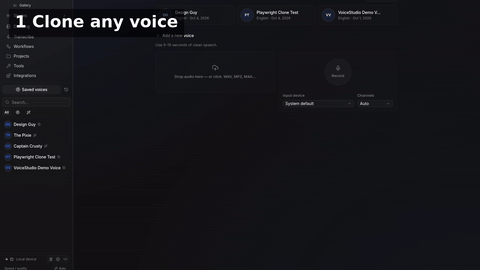

# 🎙️ VoiceStudio Experiments — Local AI Voice Lab


> **Abstract.** This repository proves, with playable audio and screenshots, that
> a complete AI voice studio — voice cloning, voice design, speech-to-text in
> three engines, video dubbing in Spanish and Arabic, multi-voice stories and
> audiobooks — runs **entirely on one local computer** (RTX 3090, ~8.6 GB of
> models, zero cloud, zero API keys for speech). Every claim below links to a
> real artifact in this repo. If you are new to voice AI, read the
> [🌱 Beginner guide](#-beginner-guide--read-this-and-you-are-a-professional)
> first — ten minutes there teaches you what most interview candidates cannot
> explain.



🎬 **[Watch the 30-second tour (demo.mp4)](demo.mp4)** · 🖼️ **[Open the visual showcase (preview.html)](preview.html)** — screenshots, audio players, and the full story in one beautiful page.

## Contents

- [🌱 Beginner guide — read this and you are a professional](#-beginner-guide--read-this-and-you-are-a-professional)
- [✨ Features — everything this lab demonstrates](#-features--everything-this-lab-demonstrates)
- [🧑‍🤝‍🧑 User stories — who is this repo for](#-user-stories--who-is-this-repo-for)
- [🧪 Experiments (with proof)](#-experiments-with-proof)
- [🧠 Models used](#-models-used)
- [🖥️ Hardware — what you need](#️-hardware--what-you-need)
- [🚀 Reproduce it yourself](#-reproduce-it-yourself)
- [❓ FAQ](#-faq)
- [⚖️ Notes & licenses](#️-notes--licenses)

## 🌱 Beginner guide — read this and you are a professional

> Let's work this out in a step-by-step way to be sure we have the right answer.

**What is "voice AI"?** Three machines working in a chain:

1. **Ears (ASR — automatic speech recognition).** Turns sound into text.
   You upload a recording of someone saying *"Schedule a meeting…"* and get the
   sentence back as text. Accuracy is measured in *word error rate* — fewer
   wrong words is better.
2. **Brain (translation / language model, optional).** Turns text in one
   language into another, or decides what to say next.
3. **Mouth (TTS — text-to-speech).** Turns text into spoken audio in a chosen
   voice. *Voice cloning* means the mouth imitates a specific person from a
   5–15 second sample of them.

**The five words that make you sound professional:**

| Word | Plain meaning | Example in this repo |
|---|---|---|
| **Clone** | Copy a real voice from a short sample | `audio/01`, `audio/10–13` |
| **Design** | Invent a voice from a description, no sample needed | `audio/02` |
| **Transcribe** | Audio → text (the "ears") | Experiment 6 |
| **Dub** | Video in → same video speaking another language | Experiments 4–5 |
| **VRAM** | The GPU's own fast memory; big AI models live there | See `HARDWARE.md` |

**How a dubbing job flows (the whole pipeline in one paragraph):** upload video
→ extract its audio → transcribe it with timestamps (ears) → translate each
timed segment (brain) → speak every segment in the new language (mouth) →
stretch or fit each piece into its time slot → mix with the original video.
You can hear every stage in the files below.

## ✨ Features — everything this lab demonstrates

| Feature | What you do | Proof |
|---|---|---|
| 🎤 Voice cloning | 7-second sample → reusable voice | `audio/01`, `10–13` |
| 🎨 Voice design | Describe → new voice, no sample | `audio/02` |
| ⚡ Instant preset voices | 8 English voices, CPU-only, no cloning | `audio/03` |
| 🎞️ Video dubbing EN→ES | Full pipeline to a dubbed mix | `audio/04`, `screenshots/02` |
| 🌍 Arabic dubbing | Translation + Arabic speech, natural timing | `audio/05–06`, `08` |
| 🎧 Transcription ×3 engines | Same clips, Whisper Tiny vs Parakeet v3 | Experiment 6 |
| 📖 Stories & audiobooks | Multi-line scripts, M4B chapters | `audio/07`, `09` |
| 🎭 Multi-voice cast | 3 voices, one render, inline voice tags | `audio/09`, `screenshots/04` |
| 🖥️ Full app tour | 9 workspace screenshots + 30 s video | `screenshots/tour-*`, `demo.mp4` |

## 🧑‍🤝‍🧑 User stories — who is this repo for

- **🎬 The YouTuber.** Your video gets Spanish and Arabic voice tracks overnight,
  on your own PC — no per-minute cloud bill. See Experiments 4–5.
- **📚 The storyteller.** Write dialogue once, cast a villain, a child and a
  narrator, export an M4B audiobook. See Experiments 7–8.
- **🎙️ The podcaster.** Clone your own voice, then generate pickup lines and
  ad reads without re-recording. See Experiment 9 (`audio/10–13`).
- **🧏 The meeting-notes person.** Drop recordings in, get text out — offline,
  private. See Experiment 6.
- **🛠️ The builder.** Copy the reproduce steps, verify the API calls, extend
  with your own models. See `HARDWARE.md` + Reproduce.
- **🎓 The student.** Read the beginner guide, listen to every file, then
  explain the ASR→translate→TTS chain out loud. You will know more than most
  interview candidates.

## 🧪 Experiments (with proof)

*All rendered 2026-10-04 on RTX 3090 + VoiceStudio v0.5.6 (Docker, CUDA).
`audio/` holds WAV/MP3/M4B — press play on any file.*

### 1. Voice clone → new speech (`audio/01-clone-playwright-voice.wav`, 11.96 s)
Cloned `demo_voice.wav` (7.28 s reference) into *"Playwright Clone Test"*, then
generated a brand-new sentence:
> "This is a real clone test from the bundled demo voice, rendered locally on the
> RTX 3090. The voice was cloned from a seven second reference and speaks this
> new sentence."

### 2. Voice design (`audio/02-design-first-take.wav`, 7.1 s)
Designed voice (Narrator, middle-aged · low pitch), script:
> "Welcome aboard. I was just a three-second clip a moment ago — now I can say
> anything you'd like, in your voice or mine."

### 3. KittenTTS preset voice (`audio/03-kittentts-default-voice.wav`, 11.2 s)
`engine=kittentts` via the local API, no cloning step (presets are
`expr-voice-2/3/4/5-m/f`, default `expr-voice-2-f`):
> "Hello from Kitten, the tiny turbo voice. Eight presets, English only, renders
> in a blink on plain CPU."

### 4. Video dub EN→ES (`audio/04-dub-spanish-mix.wav` + `screenshots/02`)
`source.mp4` (11 s) → transcribe (2 timed segments: 0:00–0:04.5, 0:04.8–0:11.0)
→ Argos `en→es` → TTS → mux. Status path: Extracting → Transcribing →
Translations ready → **Dub complete**.

### 5. Arabic TTS (`audio/05-dub-arabic-seg1.wav` 6.0 s, `audio/06-dub-arabic-seg2.wav` 8.7 s)
Argos `en→ar` translation rendered to Arabic speech with OmniVoice.
Finding: the UI dub page blocks generic "Arabic" (*Choose a supported language*)
because the engine's 646 display names list dialects but no plain "Arabic" —
the backend (`supported_languages = ["multi"]`) synthesizes `ar` fine, so this
went through the API.

### 5b. Arabic v2 — natural rate (`audio/08-dub-arabic-v2-natural-rate.wav`, 15.4 s mix)
V1 sounded rushed: the job used `strict_slot` timing (6.0 s squeezed into 4.7 s).
V2 fixes the wording (e.g. التلاعب بالفيديو → دبلجة الفيديو, feminine verbs →
neutral) and re-renders with `stretch_video` timing — speech at natural rate
(6.71 s + 8.03 s), video yields instead of the voice. Same Speaker-1 clone.

### 6. Transcription shootout (Whisper Tiny vs Parakeet v3, same clips)
`en_conversational.wav` → **both word-perfect**:
> "Schedule a meeting with Pat for Tuesday at 3 p.m. and remind me to bring the
> quarterly report."
`en_technical.wav` → near-tie on jargon (Tiny: "renderer.to 6", Parakeet:
"renderer.tisx"; Parakeet punctuates better).
`fr_reservation.wav` → Parakeet auto-detected French:
> "Bonjour, je voudrais réserver une table pour deux personnes à 20 heures."

### 7. Story render (`audio/07-lighthouse-story.m4b` + `.mp3`, 0:59 + `screenshots/03`)
Sample story *"The Lighthouse at Wits' End"* (2 chapters, 151 words, pauses and
`[laughter]`/`[sigh]` markup) → M4B audiobook with chapters.

### 8. Multi-voice story (`audio/09-pirate-and-pixie-3voices.m4b` + `.mp3`, 0:24 + `screenshots/04`)
*"The Pirate and the Pixie"* — 4 lines, 3 voices in one render: narrator
(Demo Voice), villain (Gallery archetype **Captain Crusty**), child (Gallery
archetype **The Pixie**). Archetypes join via Gallery → Use voice → per-line
`[voice:<id>]` inline tags. Zero downloads.

### 9. "Design Guy" sessions (`audio/10`–`13`)
The voice from experiment 2 cloned into a reusable profile (*Design Guy*),
then four new takes: movie trailer (`10`, 4.4 s), comedy ad (`11`, 6.7 s),
story opening (`12`, 6.1 s), secret (`13`, 6.5 s).

## 🧠 Models used

| Model | Size | Job |
|---|---|---|
| `k2-fsa/OmniVoice` | 2.4 GB | TTS: clone, design, stories, dub voice |
| `Systran/faster-whisper-large-v3` | 2.9 GB | ASR: best word timestamps (dubbing) |
| `deepdml/faster-whisper-large-v3-turbo-ct2` | 1.6 GB | ASR: 5× faster transcription |
| `csukuangfj/sherpa-onnx-whisper-tiny` | 245 MB | Live dictation, 90+ langs, CPU |
| `csukuangfj/sherpa-onnx-nemo-parakeet-tdt-0.6b-v3-int8` | 682 MB | Best EN/EU dictation accuracy |
| `KittenML/kitten-tts-mini-0.8` | 110 MB | Instant English preset voices, CPU |
| Argos offline packs | ~100–200 MB each | `en↔es`, `en→ar`, `ar→en` translators |

> What each model costs in VRAM/RAM/CPU, and what smaller machines need:
> see **[HARDWARE.md](HARDWARE.md)**.

## 🖥️ Hardware — what you need

Short version: an **8 GB+ VRAM NVIDIA card + 16 GB RAM** is the sweet spot;
no GPU still works (slower); this lab's 3090 is ~3–4× overprovisioned. Full
per-model table, smaller-machine guidance and tuning knobs: **[HARDWARE.md](HARDWARE.md)**.

## 🚀 Reproduce it yourself

```sh
# 1. Start VoiceStudio (GPU profile)
docker compose -f deploy/docker-compose.yml --profile gpu up
# 2. Open http://localhost:3900 and complete setup.
#    Models install one-click from Settings → Models.
#    No HuggingFace token needed — all are public.
# 3. Workspaces, in the order of this repo:
#    Clone a voice → Design → Transcribe → Dub → Stories.
```

## ❓ FAQ

**Do I need the internet?** Only to download models once. After that, unplug —
everything above renders offline.

**Do I need an API key or account?** No. Not for speech, not for models.

**Why do some files come in pairs (`.m4b` + `.mp3`)?** M4B is the audiobook
format with chapters; MP3 plays literally everywhere. Same audio, pick either.

**Why does the Arabic dub sound faster in v1?** Slot-fitting sped it 1.3×.
Listen to v2 (`08`) — natural rate. Details in experiment 5b.

**Can my computer run this?** Probably yes — see `HARDWARE.md`.

**Can I contribute?** Yes — new experiments (a French dub, a full audiobook
chapter, a new voice) are welcome: add audio + a README section + screenshots,
keep every claim linked to a file.

## ⚖️ Notes & licenses

- Audio here is synthetic; VoiceStudio watermarks generations invisibly by
  default. Voices used: the bundled demo voice, its test clones, and synthetic
  gallery archetypes (no real private individual).
- VoiceStudio is AGPL-3.0; model weights carry their own licenses (review before
  commercial use); clone voices only with permission.
- This repo's own text and scripts: MIT — see `LICENSE`.
- Two hiccups hit during the session, both recovered: transient download stalls
  (resume/retry completed them) and a browser re-auth gate after backend
  idle-unload (re-enter the API key).
